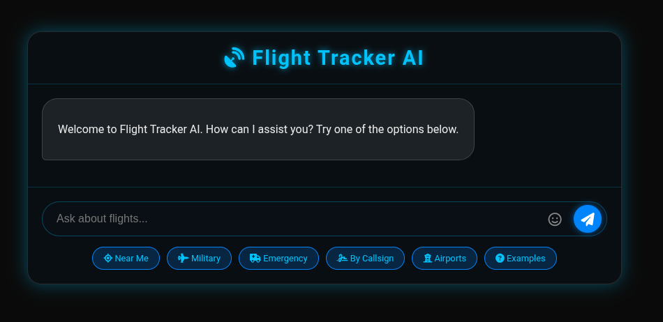
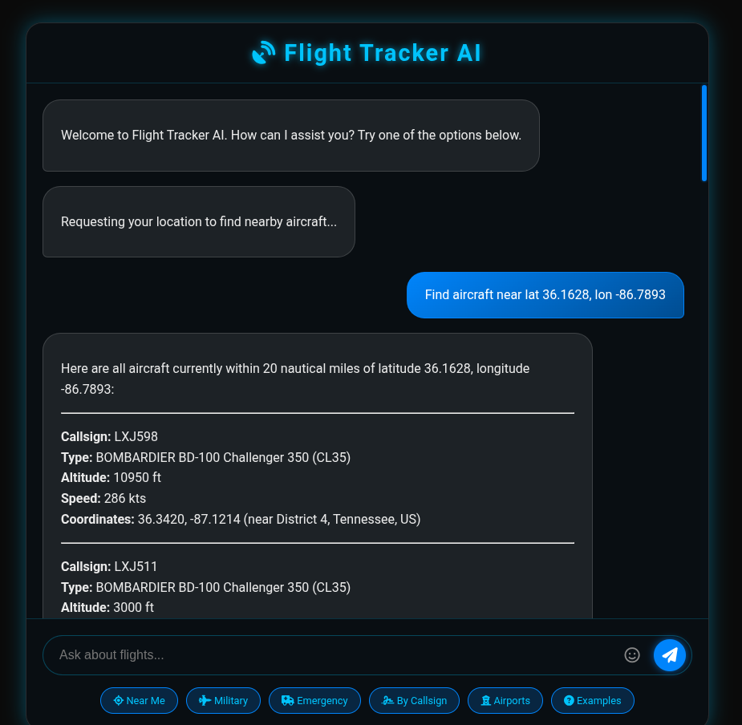
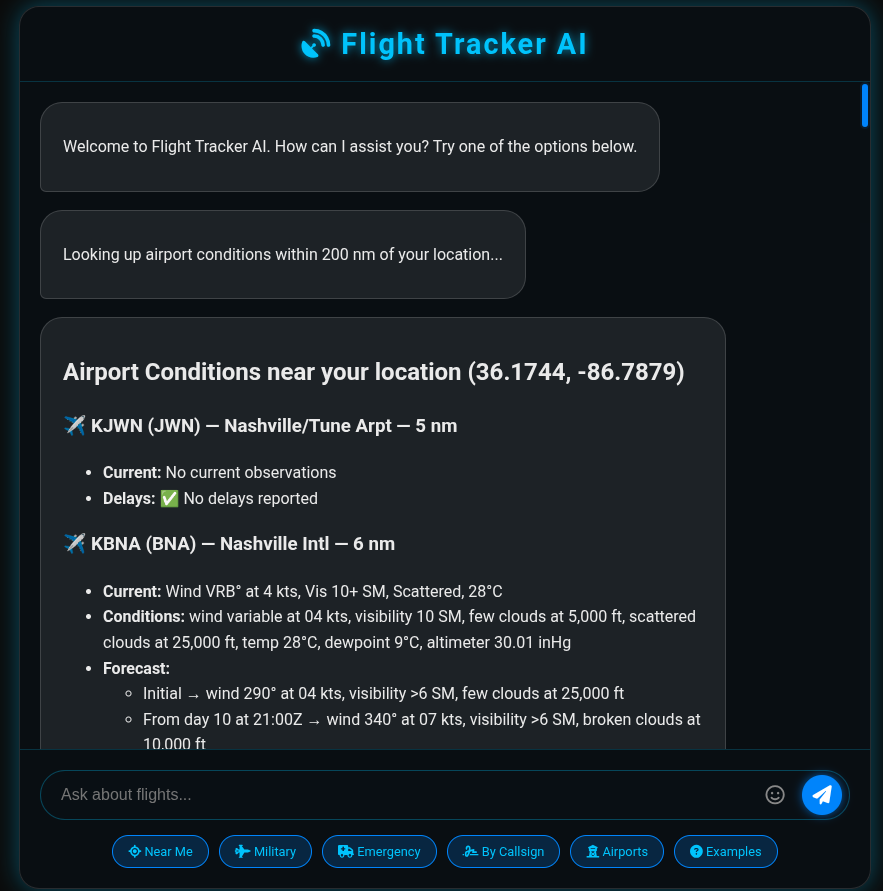
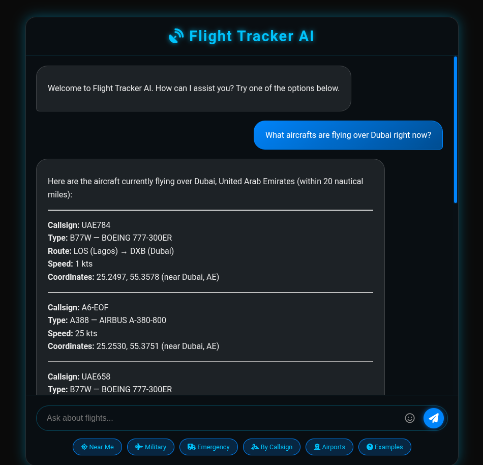
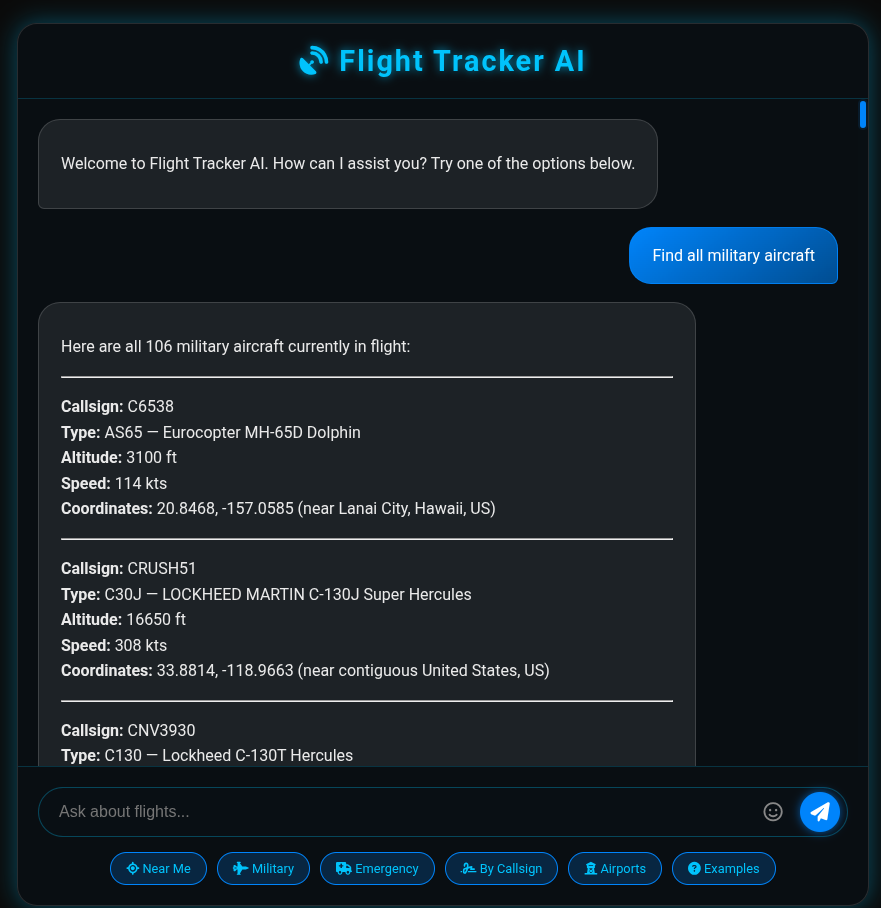

# Flight Tracker AI

A Spring Boot web application that turns plain-English questions about live air
traffic into structured ADS-B lookups, geographic searches, route resolution,
and airport-conditions reports — all backed by a chat-style UI and a
function-calling LLM.

> Ask *"what military aircraft are flying near me right now?"* or click
> **Airports** and get plain-English METAR + TAF + delay info for every
> reporting airport within 200 nautical miles of your location.

<!-- SCREENSHOT: top-level chat UI with the suggestion chips -->
<!--  -->

---

## Features

- **Conversational aviation assistant** — natural-language questions are routed
  to typed tool calls via [LangChain4j](https://github.com/langchain4j/langchain4j).
- **Live aircraft search** — by location, callsign, military status, emergency
  squawk, or city + country name (with optional radius).
- **Auto-detected user location** — `Near Me` chip uses the browser's
  Geolocation API; the chat enriches every prompt with an IP-geolocated
  fallback so the LLM knows where "near me" is.
- **Route enrichment** — every airline-callsign lookup is decorated with the
  flight's published origin → destination, geo-validated against the
  aircraft's actual position so stale callsign/route mappings are filtered
  out.
- **Reverse geocoding for positions** — every aircraft coordinate gets a
  *"near City, State, Country"* annotation.
- **Nearest-airport conditions** — METAR (current weather), TAF (forecast),
  and FAA NAS Status (US ground stops / ground delays / closures), each
  decoded into plain English.
- **Aircraft type display** — type/description (e.g. *"B738 — Boeing 737-800"*)
  shown alongside callsign, altitude, speed, and route.
- **Rate limited** — token-bucket per client IP keeps the public APIs happy.
- **Container-ready** — single command produces a Cloud Native Buildpacks
  Docker image; opt-in profile for a GraalVM native image build.

---

## Screenshots

<!-- Drop screenshot files into docs/screenshots/ and uncomment the lines below. -->

### Chat UI
<!--  -->

### "Near Me" — Aircraft within 20 nm
<!--  -->

### "Airports" — METAR / TAF / delays within 200 nm
<!--  -->

### Aircraft above a named city
<!--  -->

### Military / Emergency aircraft search
<!--  -->

---

## Architecture

```
                         ┌────────────────────────────┐
                         │   Browser (index.html)     │
                         │  - chat input              │
                         │  - suggestion chips        │
                         │  - marked.js renderer      │
                         └─────────────┬──────────────┘
                                       │ HTTP (text/markdown)
                                       ▼
┌─────────────────────────────────────────────────────────────────┐
│                     FlightController (REST)                     │
│  /ask  · /airports  · /examples  · /health                      │
│  - bucket4j rate limiting per client IP                         │
└──────────┬──────────────────────────────────┬───────────────────┘
           │                                  │
           ▼                                  ▼
┌────────────────────────┐         ┌──────────────────────────────┐
│ FlightAssistantService │         │ AirportConditionsService     │
│  - enrich query with   │         │  - stationinfo (directory)   │
│    IP-geolocated user  │         │  - METAR (current weather)   │
│    coordinates         │         │  - TAF (forecast)            │
│  - delegate to LLM     │         │  - FAA NAS Status (delays)   │
└──────────┬─────────────┘         │  - WeatherDecoder            │
           │                       └────────────┬─────────────────┘
           ▼                                    │
┌────────────────────────────┐                  │
│ LangChain4j AiService      │                  │
│  (FlightAIService)         │                  │
│  - system prompt           │                  │
│  - chat memory (20 msgs)   │                  │
│  - tools registered        │                  │
└──────────┬─────────────────┘                  │
           │ function calls                     │
           ▼                                    │
┌────────────────────────────────────────────┐  │
│         FlightDataFunctions (@Tool)        │  │
│  - findAircraftNearLocation                │  │
│  - findAircraftAboveCity                   │  │
│  - findAircraftByCallsign                  │  │
│  - findMilitaryAircraft                    │  │
│  - findEmergencyAircraft                   │  │
│  - getAirportConditionsForCity ────────────┼──┘
└──────────┬─────────────────────────────────┘
           │
           ▼
┌────────────────────────────────────────────────────────────────┐
│                   Domain & lookup services                     │
│                                                                │
│  FlightDataService    → opendata.adsb.fi      (ADS-B live)     │
│  RouteService         → api.adsbdb.com        (airline routes) │
│  GeoLocationService   → ip-api.com            (IP → lat/lon)   │
│  GeocodingService     → nominatim.openstreetmap.org            │
│                                              (city → lat/lon)  │
│  ReverseGeocodingService → api-bdc.io        (lat/lon → city)  │
│  AirportConditionsService → aviationweather.gov + nasstatus    │
│  GeoUtils             → haversine + cross-track math           │
│  WeatherDecoder       → METAR/TAF → plain English              │
└────────────────────────────────────────────────────────────────┘
```

---

## Tech stack

| Layer            | Choice                                              |
|------------------|-----------------------------------------------------|
| Language         | Java 25                                             |
| Framework        | Spring Boot 4.0.6 (Spring 7)                        |
| Build            | Maven (wrapper included)                            |
| LLM              | Azure OpenAI (default) or Anthropic via LangChain4j |
| HTTP client      | Apache HttpClient5 via Spring `RestClient`          |
| Rate limiting    | Bucket4j (token bucket, per client IP)              |
| Frontend         | Vanilla HTML/JS + `marked.js` + emoji-picker-element|
| Container build  | Cloud Native Buildpacks (Paketo, BellSoft Liberica) |
| Native image     | GraalVM (`native` Maven profile)                    |

### External data sources

| Source                             | Used for                                    | Auth      |
|------------------------------------|---------------------------------------------|-----------|
| `opendata.adsb.fi`                 | Live ADS-B aircraft positions               | none      |
| `api.adsbdb.com`                   | Airline routes (callsign → origin/dest)     | none      |
| `nominatim.openstreetmap.org`      | City + country → lat/lon                    | none      |
| `api-bdc.io` (BigDataCloud)        | Lat/lon → city/state/country                | none      |
| `ip-api.com`                       | Client IP → approximate location            | none      |
| `aviationweather.gov`              | METAR, TAF, station directory               | none      |
| `nasstatus.faa.gov`                | US ground stops / delays / closures         | none      |

All external services are configurable via `application.yaml` —
swap any base URL via env var or property override.

---

## Prerequisites

- **Java 25** (e.g. `Liberica NIK 25`, `Oracle GraalVM 25`, `Temurin 25`)
- **Maven** — the included `./mvnw` wrapper handles this
- **Docker** — only required for the buildpacks image build
- **GraalVM** — only required for `-Pnative` builds

### LLM credentials

Default deployment uses **Azure OpenAI** (model: `gpt-4.1`). Set:

```bash
export AZURE_OPENAI_ENDPOINT=https://<your-resource>.openai.azure.com/
export AZURE_OPENAI_KEY=<your-key>
```

Switching to Anthropic instead is a small `FlightAssistantService.java`
edit — the original `AnthropicChatModel.builder(...)` is left commented
in the constructor as a reference.

---

## Running locally

```bash
# Plain JVM run via Maven
./mvnw spring-boot:run

# Or build a fat jar and run it
./mvnw clean package
java --enable-native-access=ALL-UNNAMED \
     -jar target/flight-tracker-ai-*.jar
```

The app binds to `http://localhost:8080`. Open it in a browser — Chrome
will prompt for location permission the first time you click **Near Me**
or **Airports**.

### Testing the API directly

```bash
PUBLIC_IP=$(curl -s -4 ifconfig.me)

# Conversational query
curl -X POST http://localhost:8080/api/aviation/ask \
     -H "Content-Type: text/plain" \
     -H "X-Forwarded-For: $PUBLIC_IP" \
     -d "What commercial flights are within 30 nm of my location?"

# Airport conditions (browser geolocation simulated)
curl "http://localhost:8080/api/aviation/airports?lat=36.13&lon=-86.67"

# Health
curl http://localhost:8080/api/aviation/health
```

---

## Building a Docker image

```bash
# Default tag: flight-tracker-ai:0.0.1-SNAPSHOT
./mvnw spring-boot:build-image

# Tag with your Docker Hub username and push
./mvnw spring-boot:build-image -Ddocker.image.name=YOUR_USER/flight-tracker-ai
docker push YOUR_USER/flight-tracker-ai:0.0.1-SNAPSHOT

# Run the image
docker run -p 8080:8080 \
  -e AZURE_OPENAI_ENDPOINT=$AZURE_OPENAI_ENDPOINT \
  -e AZURE_OPENAI_KEY=$AZURE_OPENAI_KEY \
  flight-tracker-ai:0.0.1-SNAPSHOT
```

The image is built with the **Paketo BellSoft Liberica** buildpack and
pinned to Java 25 (`BP_JVM_VERSION=25`). Runtime sets
`--enable-native-access=ALL-UNNAMED` automatically to silence the JDK 24+
Netty native-access warning.

---

## REST API

| Method | Path                          | Purpose                                                                 |
|--------|-------------------------------|-------------------------------------------------------------------------|
| `POST` | `/api/aviation/ask`           | Send a free-text question; receive markdown response from the assistant |
| `GET`  | `/api/aviation/airports`      | Airport conditions within 200 nm. Optional `?lat=&lon=`                 |
| `GET`  | `/api/aviation/examples`      | Curated example prompts                                                 |
| `GET`  | `/api/aviation/health`        | Liveness check                                                          |
| `GET`  | `/actuator/health`            | Spring Boot Actuator health endpoint                                    |

All chat endpoints are token-bucket rate limited at **60 requests / minute**
per client IP (taken from `X-Forwarded-For` if present, else
`request.getRemoteAddr()`).

---

## LLM tools (function calls)

The LLM has access to these tools via LangChain4j `@Tool` annotations:

| Tool                              | Description                                                              |
|-----------------------------------|--------------------------------------------------------------------------|
| `findAircraftNearLocation`        | Aircraft within radius of explicit lat/lon                               |
| `findAircraftAboveCity`           | Geocodes city + country, then searches (default 20 nm, override allowed) |
| `findAircraftByCallsign`          | Lookup by ICAO callsign                                                  |
| `findMilitaryAircraft`            | All currently-flying military aircraft                                   |
| `findEmergencyAircraft`           | Squawking 7700 (emergency)                                               |
| `getAirportConditionsForCity`     | METAR + TAF + (US) delays for airports near a named city                 |

The system prompt (in `FlightAIService.java`) defines a strict card layout
and explicitly forbids summarisation/truncation, so a query returning 100
aircraft renders 100 cards.

---

## Project layout

```
src/
├── main/
│   ├── java/dev/example/flighttracker/
│   │   ├── FlightTrackerAiApplication.java         # Spring Boot entry
│   │   ├── controller/
│   │   │   └── FlightController.java               # REST endpoints
│   │   ├── model/                                  # Records / DTOs
│   │   │   ├── Aircraft.java
│   │   │   ├── AirportCondition.java
│   │   │   ├── FlightDataResponse.java
│   │   │   ├── GeoLocationResponse.java
│   │   │   └── RouteInfo.java
│   │   └── service/
│   │       ├── FlightAssistantService.java         # Wires the LLM
│   │       ├── FlightAIService.java                # @SystemMessage prompt
│   │       ├── FlightDataFunctions.java            # @Tool methods
│   │       ├── FlightDataService.java              # ADS-B HTTP client
│   │       ├── RouteService.java                   # Airline routes
│   │       ├── GeoLocationService.java             # IP → lat/lon
│   │       ├── GeocodingService.java               # City → lat/lon
│   │       ├── ReverseGeocodingService.java        # Lat/lon → city
│   │       ├── AirportConditionsService.java       # METAR + TAF + delays
│   │       ├── WeatherDecoder.java                 # METAR/TAF → English
│   │       └── GeoUtils.java                       # Haversine / cross-track
│   └── resources/
│       ├── application.yaml                        # Config (env-driven)
│       └── static/
│           └── index.html                          # Chat UI
└── test/
    ├── java/dev/example/flighttracker/             # Spring Boot context test
    └── resources/
        └── application.yaml                        # Dummy values for tests
```

---

## Configuration reference

All settings in `application.yaml` are overridable via environment
variables using Spring Boot's relaxed binding rules
(e.g. `flight-tracker.adsb-api.base-url` ↔ `FLIGHT_TRACKER_ADSB_API_BASE_URL`).

| Property                                        | Default                                  | Purpose                              |
|-------------------------------------------------|------------------------------------------|--------------------------------------|
| `spring.azure-ai.azure-openai-endpoint`         | `${AZURE_OPENAI_ENDPOINT}`               | Azure OpenAI resource URL            |
| `spring.azure-ai.azure-openai-key`              | `${AZURE_OPENAI_KEY}`                    | Azure OpenAI key                     |
| `spring.azure-ai.azure-deployment-name`         | `gpt-4.1`                                | Azure deployment name                |
| `flight-tracker.adsb-api.base-url`              | `https://opendata.adsb.fi/api/v2`        | ADS-B feed                           |
| `flight-tracker.adsb-api.timeout`               | `30s`                                    | Per-request timeout                  |
| `flight-tracker.geo-api.base-url`               | `http://ip-api.com/json`                 | IP geolocation                       |
| `flight-tracker.route-api.base-url`             | `https://api.adsbdb.com/v0`              | Airline route lookup                 |
| `flight-tracker.geocoding-api.base-url`         | `https://nominatim.openstreetmap.org`    | City/country geocoding               |
| `flight-tracker.reverse-geocoding-api.base-url` | `https://api-bdc.io`                     | Reverse geocoding                    |
| `flight-tracker.aviation-weather-api.base-url`  | `https://aviationweather.gov/api`        | METAR / TAF / station directory      |
| `flight-tracker.faa-nas-api.base-url`           | `https://nasstatus.faa.gov/api`          | US airport delays                    |
| `flight-tracker.rate-limit.requests-per-minute` | `60`                                     | Token-bucket capacity per client IP  |

---

## Acknowledgements

- ADS-B data courtesy of the [ADS-B Finland open feed](https://opendata.adsb.fi/)
- Airline route lookups from [adsbdb.com](https://www.adsbdb.com/)
- Weather data from [NOAA / NWS Aviation Weather Center](https://aviationweather.gov/)
- US delay data from the [FAA NAS Status feed](https://nasstatus.faa.gov/)
- Geocoding from [OpenStreetMap Nominatim](https://nominatim.openstreetmap.org/)
- Reverse geocoding from [BigDataCloud](https://www.bigdatacloud.com/)
- IP geolocation from [ip-api.com](https://ip-api.com/)

This project is a personal learning sandbox; not affiliated with or
endorsed by any of the data providers above.
